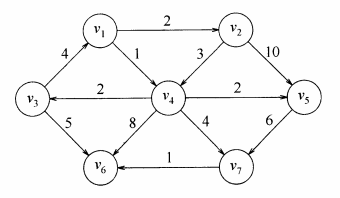

# 图论

## 表示方法

假设现在有一个有向有权图  

### 邻接表

From 代表边出发的点， To 代表边到达的点。

- 无向图时，(From, To) 与 (To, From) 成对出现
- 有向图时，只有 From 指向 To 的边

| From | To             |
|------|----------------|
| v1   | v2, v4         |
| v2   | v4, v5         |
| v3   | v1, v6         |
| v4   | v3, v5, v6, v7 |
| v5   | v7             |
| v6   | (empty)        |
| v7   | v6             |

### 邻接矩阵

第 (i, j) 个格子的元素代表，从节点 i 到节点 j 的边的权重。

- 无权图时，值为 1 代表两个节点间有边相连，为 0 代表两个节点没有边相连。
- 有权图时，矩阵元素的值代表边的权重，为无穷时表示两个节点之间没有边相连。

|    | v1    | v2    | v3    | v4    | v5     | v6    | v7    |
|----|-------|-------|-------|-------|--------|-------|-------|
| v1 | 0     | **2** | 0     | **1** | 0      | 0     | 0     |
| v2 | 0     | 0     | 0     | **3** | **10** | 0     | 0     |
| v3 | **4** | 0     | 0     | 0     | 0      | **5** | 0     |
| v4 | 0     | 0     | **2** | 0     | **2**  | **8** | **4** |
| v5 | 0     | 0     | 0     | 0     | 0      | 0     | **6** |
| v6 | 0     | 0     | 0     | 0     | 0      | 0     | 0     |
| v7 | 0     | 0     | 0     | 0     | 0      | **1** | 0     |

## 图的结构

- 点的结构
[实现](./structure/Node.java)
- 边的结构
[实现](./structure/Edge.java)
- 图（由点的集合和边的集合组成）
[实现](./structure/Graph.java)

## 图的遍历

### 宽度优先遍历

[代码实现](./BFS.java)

从某个节点出发，始终优先访问距离最近的顶点，并一层层向外扩张。

通过队列实现，离开队列时打印。再加入一个 Set 集合，防止重复访问节点形成循环。

### 深度优先遍历

[代码实现](./DFS.java)

从某个节点出发，优先走到底、无路可走再回头的遍历方式。

通过栈实现（递归则自动调用栈），进入栈时就打印，栈中存放的是已走过的路径记录。再加入一个 Set 集合，防止重复访问节点。

## 最短路径算法

### 1. Dijkstra 算法

[代码实现](./Dijkstra.java)

从给定的点出发，不断循环更新每个点到起点的最短距离。

实际上也是贪心的思想。
